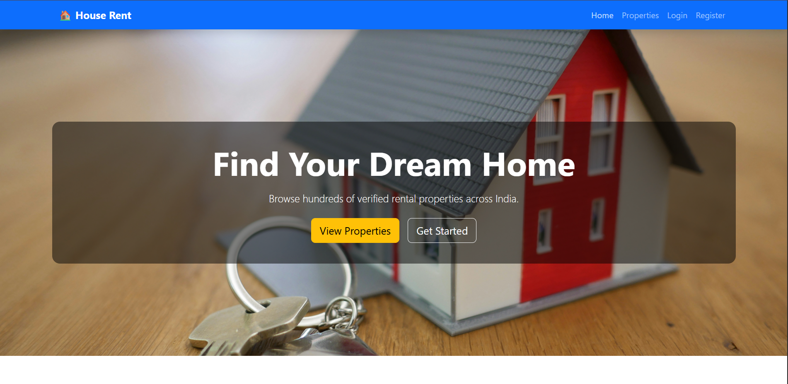
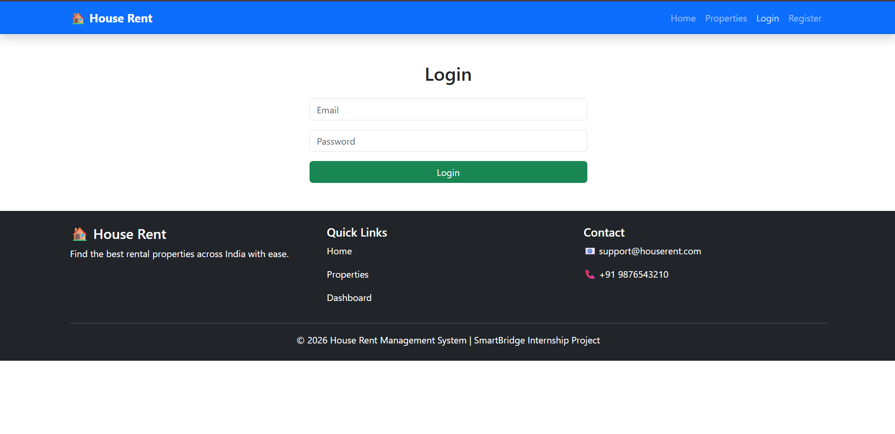
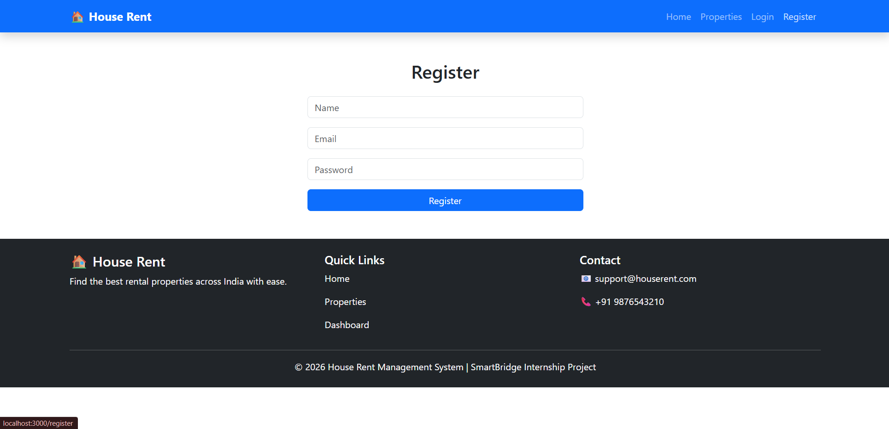
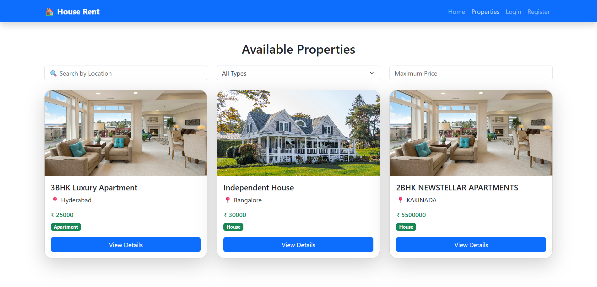
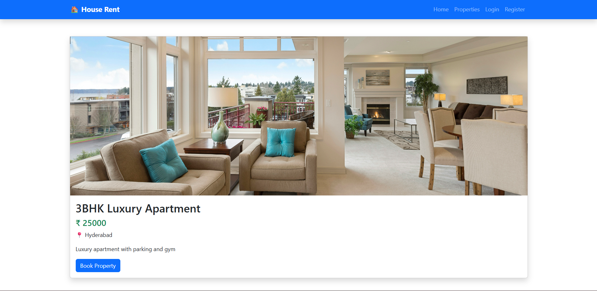
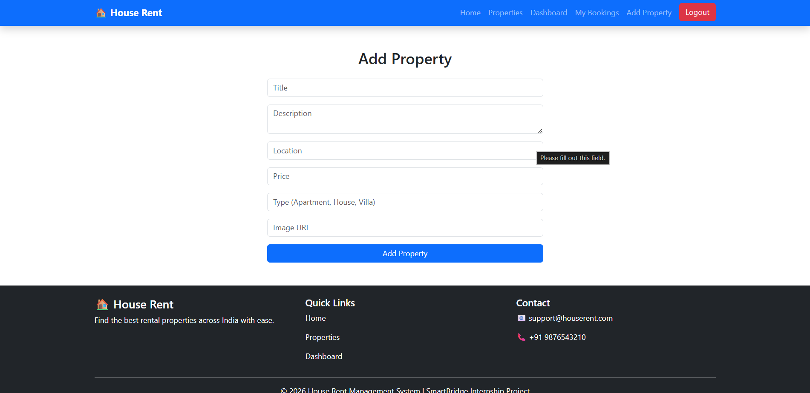
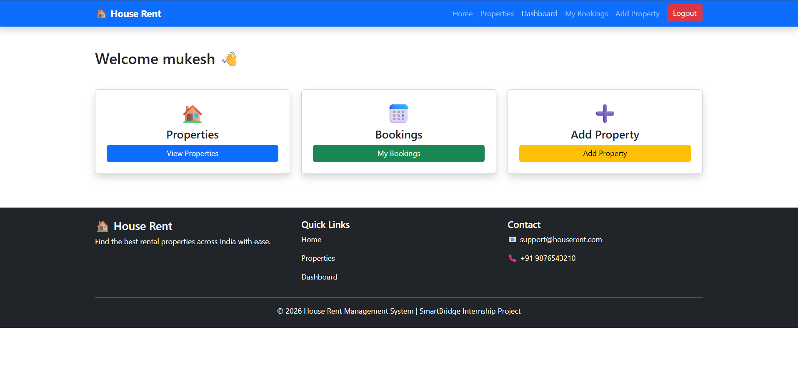
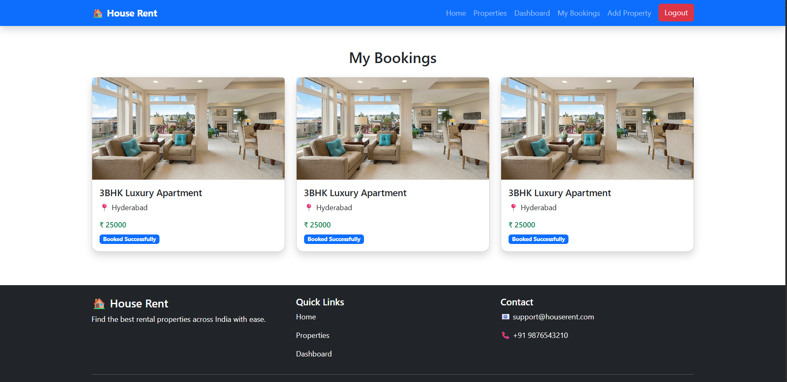

# 🏠 House Rent Management System

A full-stack **House Rent Management System** developed using the **MERN Stack (MongoDB, Express.js, React.js, Node.js)**. This application allows users to register, log in securely, browse rental properties, add new properties, search and filter listings, book properties, and manage their bookings.

---

## 📌 Features

* User Registration
* User Login using JWT Authentication
* Add New Property
* View All Properties
* Property Details Page
* Book a Property
* View My Bookings
* Dashboard
* Search Properties by Location
* Filter by Property Type
* Filter by Maximum Price
* Responsive User Interface

---

## 🛠 Technologies Used

### Frontend

* React.js
* React Router DOM
* Bootstrap 5
* Axios

### Backend

* Node.js
* Express.js

### Database

* MongoDB Atlas
* Mongoose

### Authentication

* JSON Web Token (JWT)
* bcryptjs

---

## 📂 Project Structure

```text
House-Rent-Management-System/
│
├── client/
│   ├── public/
│   ├── src/
│   │   ├── components/
│   │   ├── pages/
│   │   ├── services/
│   │   ├── App.js
│   │   └── index.js
│   ├── package.json
│   └── package-lock.json
│
├── server/
│   ├── config/
│   ├── controllers/
│   ├── middleware/
│   ├── models/
│   ├── routes/
│   ├── package.json
│   └── server.js
│
├── Documentation/
│   └── Documentation.pdf
│
├── Phase Wise Templates/
│   ├── Brainstorming & Ideation Phase/
│   ├── Project Design Phase/
│   ├── Project Development/
│   ├── Project Planning Phase/
│   └── Requirement Analysis/
│
├── screenshots/
│   ├── home.png
│   ├── login.png
│   ├── register.png
│   ├── properties.png
│   ├── property-details.png
│   ├── add-property.png
│   ├── dashboard.png
│   └── my-bookings.png
│
├── .gitignore
└── README.md
```

## ⚙ Installation

### Clone the repository

```bash
git clone <repository-url>
```

### Backend

```bash
cd server
npm install
npm start
```

### Frontend

```bash
cd client
npm install
npm start
```

---

## 🔐 Authentication

The application uses **JWT (JSON Web Token)** for secure authentication. After a successful login, a JWT token is generated and stored in Local Storage. Protected routes verify this token before allowing access.

---

## 📷 Screenshots

### 🏠 Home Page


### 🔑 Login Page


### 📝 Register Page


### 🏘️ Properties Page


### 📄 Property Details Page


### ➕ Add Property Page


### 📊 Dashboard


### 📅 My Bookings


## 🚀 Future Enhancements

* Online Payment Gateway
* Property Approval by Admin
* Google Maps Integration
* Property Reviews & Ratings
* Email Notifications
* Cloudinary Image Upload

---

## 👨‍💻 Developed By

**PILLI VIJAYAKUMARI**<br>
**CHINTAKULA MUKESH NARAYANA**<br>
**DASARI JEEVAN SAI CHAKRI**<br>
**DASARI TEJEESWARI**

Full Stack Development with MERN Internship Project.
